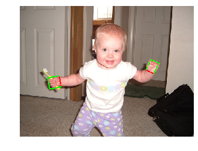

# Hand Detection - YOLOv7
<a name="readme-top"></a>

<!-- ABOUT THE PROJECT -->
## Introduction
Object detection is a computer vision technique that allows us to identify and locate objects in an image or video. With this kind of identification and localization, object detection can be used to count objects in a scene and determine and track their precise locations while accurately labeling them. Object detection is commonly confused with image recognition, so before we proceed, it’s important that we clarify the distinctions between them. Image recognition assigns a label to an image. A picture of a dog receives the label “dog”. A picture of two dogs still receives the label “dog”. Object detection, on the other hand, draws a box around each dog and labels the box “dog”. The model predicts where each object is and what label should be applied.
The purpose of this project is training a hand detection model using YOLOv7 with COCO dataset.



<!-- ARCHITECTURE -->
## Architecture
In this model, we used YOLOv7 as the architecture. YOLOv7 surpasses all known object detectors in both speed and accuracy in the range from 5 FPS to 160 FPS and has the highest accuracy 56.8% AP among all known real-time object detectors with 30 FPS or higher on GPU V100. YOLO architecture is FCNN(Fully Connected Neural Network) based. However, Transformer-based versions have also recently been added to the YOLO family.

The YOLO has three main components.

* Backbone
* Head
* Neck

The Backbone mainly extracts essential features of an image and feeds them to the Head through Neck. The Neck collects feature maps extracted by the Backbone and creates feature pyramids. Finally, the head consists of output layers that have final detections.

YOLOv7 improves speed and accuracy by introducing several architectural reforms. The following major changes have been introduced in the YOLOv7 paper.

* Architectural Reforms

    * E-ELAN (Extended Efficient Layer Aggregation Network)
    * Model Scaling for Concatenation-based Models
    
* Trainable BoF (Bag of Freebies)

    * Planned re-parameterized convolution
    * Coarse for auxiliary and Fine for lead loss

You can see detailed information about these additions in this [paper][1].
<p align="right">(<a href="#readme-top">Back to Top</a>)</p>

<!-- DATASET -->
## Dataset
The COCO-Hand dataset contains annotations for 25K images of the Microsoft's COCO dataset. To see the details of the dataset, please visit this [page][2].
<p align="right">(<a href="#readme-top">Back to Top</a>)</p>

<!-- GETTING STARTED -->
## Getting Started
Instructions on setting up your project locally.
To get a local copy up and running follow these simple steps.

### Download dataset
To download the dataset, run **getCoco.sh**.
  ```sh
  sudo apt-get install unzip
  sh data/getCoco.sh
  ```
It will be downloaded inside to **data/coco** folder.

### Download base models
You can download the base model by visiting the link below.

* [yolov7_training.pt][4]

### Install dependencies
To install the required packages. In a terminal, type:
  ```sh
  pip install -r src/requirements.txt
  ```

### Convert the annotations
Now that we have our dataset, we need to convert the annotations into the format expected by YOLOv7. YOLOv7 expects data to be organized in a specific way, otherwise it is unable to parse through the directories.
  ```sh
  python src/convert_annotations.py --images 'path to coco images folder' --annotations 'path to coco annotations txt'
  ```
To see if the conversion is correct, run.
  ```sh
  python src/convert_annotations.py --images 'path to coco images folder' --annotations 'path to coco annotations txt' --plot
  ```

### Partition the Dataset
Next, we need to partition the dataset into train, validation, and test sets. These will contain 80%, 10%, and 10% of the data, respectively.
  ```sh
  python src/prepare_data.py --path 'path to coco images folder'
  ```

### Training
The training specifications are:
* Epoch: 300
* Dataset: Hand COCO
* Batch size: 4
* Image size: 640
* GPU: NVIDIA GeForce RTX 3060 Laptop GPU

If you are having fitting the model into the memory:
* Use a smaller batch size.
* Use a smaller network: the yolov7-tiny.pt checkpoint will run at lower cost than the basic yolov7_training.pt.
* Use a smaller image size: the size of the image corresponds directly to expense during training. Reduce the images from 640 to 320 to significantly cut cost at the expense of losing prediction accuracy.

To start the training:
  ```sh
  python src/yolov7/train.py --img-size 640 --cfg src/cfg/training/yolov7.yaml --hyp data/hyp.scratch.yaml --batch 4 --epoch 300 --data data/hand_data.yaml --weights src/models/yolov7_training.pt --workers 2 --name yolo_hand_det --device 0
  ```

You can also train the model on Google Colab.

<a href="https://colab.research.google.com/github/nuwandda/yolov7-hand-detection/blob/main/src/train.ipynb"></a>

### Inference
To test the training model:
  ```sh
  python src/yolov7/detect.py --source data/sample/test --weights runs/train/yolo_hand_det/weights/best.pt --conf 0.25 --name yolo_hand_det
  ```
<p align="right">(<a href="#readme-top">Back to Top</a>)</p>

[1]: https://arxiv.org/pdf/2207.02696.pdf
[2]: https://www3.cs.stonybrook.edu/~cvl/projects/hand_det_attention/
[3]: https://arxiv.org/pdf/2008.05359.pdf
[4]: https://drive.google.com/file/d/1Uch80u6CVGQK4EfxvDtae4DhbgdyOUZH/view?usp=share_link
[5]: https://drive.google.com/file/d/1flQiEhQ4bfYwntRFCz0mw-wbKL0fDrsJ/view?usp=share_link
[6]: https://drive.google.com/file/d/1tTjodl4IbJChQizY7pL5M1lXwXSiImS4/view?usp=share_link
[7]: https://github.com/WongKinYiu/yolov7/releases/download/v0.1/yolov7-e6e_training.pt


